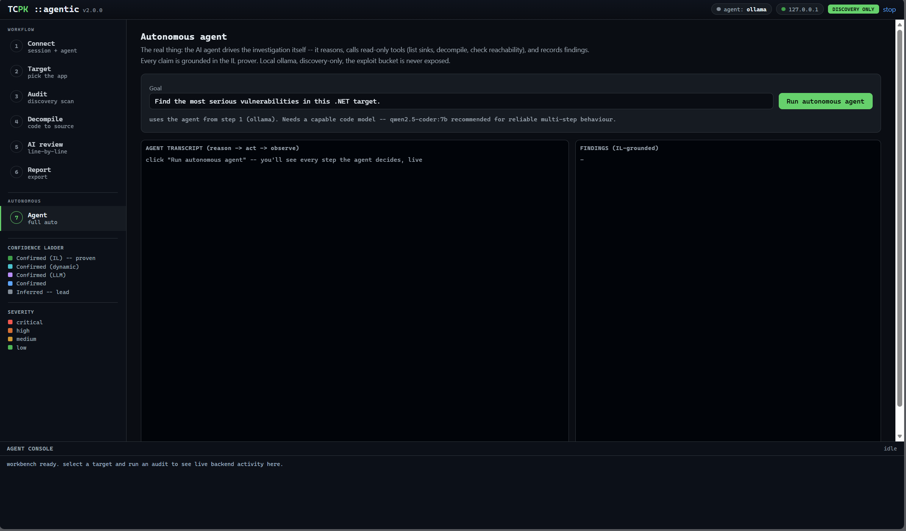

<div align="center">
  

  # TCPK -- Thick Client Pentest Kit

  Portable Windows thick-client / MSIX security audit tool.
  **Find. Verify. Report.**

  PowerShell engine, WinForms GUI, an agentic AI workbench (loopback browser UI), and a native MCP server.
  Authorized testing only.
</div>

---

## The tool


Point it at an MSIX package, an installed folder, or a single `.exe`, click **Run Audit**, and
TCPK runs ~168 checks across a dozen buckets, streams findings live, and writes HTML + Excel
reports. Every finding carries a confidence label, a **computed CVSS v4.0** base score, CWE,
MITRE ATT&CK, and an OWASP TASVS mapping. The same engine drives the CLI, a native **MCP
server**, and an **agentic AI workbench** (`TCPK-Agentic.bat` -- loopback, token-gated,
discovery-only) with decompile, local AI review, and an autonomous agent.



## What makes it different

- **Evidence over guessing.** Regex hits are `Inferred`; a Mono.Cecil IL bridge then *proves*
  the high-value ones (e.g. an accept-all TLS callback decompiled and proven to `return true`)
  and promotes them to `Confirmed (IL)` via a bounded source-to-sink taint check -- deterministic,
  no model.
- **Real CVSS v4.0.** A faithful port of the FIRST.org algorithm scores each finding from its own
  vector, so a local issue is never mislabelled as network-reachable.
- **Supply-chain CVEs.** Shipped components matched against live OSV (NuGet/npm/Maven) + NVD-by-CPE
  (native libs), version-accurate, embedded in a CycloneDX SBOM. Online-only, fails closed.
- **Local-first AI triage (optional).** `-EnableLlm` pipes findings through a local Ollama model;
  cloud is gated behind an explicit opt-in (decompiled IL never leaves the box by default).
- **Engagement-ready reports.** HTML (confidence-segregated) + multi-sheet Excel with a 55-case
  Checklist, DLL Hardening + Signing matrices, plus JSON, SARIF, a CycloneDX SBOM, and a
  self-contained `intel.html` dashboard.
- **Live-process tooling.** A Runtime/Live tab of read-only process checks and a Process Monitor
  (live watch + activity capture), plus a Hex view with a data inspector, strings, and byte
  colouring -- in both the desktop GUI and the agentic workbench.
- **Honest about scope.** It automates *detection*; dynamic confirmation (Burp, mimikatz,
  modify-and-relaunch) stays manual -- and the tool says so.

## Coverage

`A` Static binary - `B` MSIX manifest - `C` OS integration - `D` Credentials - `E` Runtime/live -
`F` Network - `G` WebView2 - `H` Logging - `I` Memory - `J` Anti-debug - `K` Exploit (gated) --
plus Recon / Report.

Full check catalogue in [`docs/CHECKS.md`](docs/CHECKS.md); the 55-case thick-client test plan is
auto-correlated in the Excel **Checklist** sheet (53 of 55 automated). Full technical write-up in
[`docs/index.html`](docs/index.html) (published as a free GitHub Pages site).

## Supported targets

Path-based: MSIX / AppX / `.msixbundle` / `.zip`, an installed or extracted folder, or a single
portable `.exe` -- MSIX, MSI, ClickOnce, Squirrel, and portable apps alike (manifest checks
auto-skip when absent). For thin clients it audits the client-side binaries; the remote API is a
separate engagement.

## Quick start

**GUI:** double-click `TCPK.bat` (keep the whole folder together), accept the authorized-use
prompt, pick a target, click **Run Audit**.

**PowerShell:**
```powershell
Import-Module .\TCPK\TCPK.psd1 -Force
Invoke-TcpkAudit -Target 'C:\Path\To\App' -Acknowledge              # static + OS + network ...
Invoke-TcpkAudit -Target 'C:\Path\To\App' -Acknowledge -EnableLlm   # + local AI triage
```
Reports land in `.\out\<target>_<date>\`: `index.html`, `report.xlsx`, `findings.json`,
`sbom.cdx.json`, `report.sarif`, `intel.html`.

## Requirements

Windows 10/11, PowerShell 5.1 or 7+. Admin only for some deep runtime checks. Optional local AI
needs [Ollama](https://ollama.com) + a pulled model (e.g. `qwen2.5-coder:7b`).

## Authorized use only

For security testing of software you own or are explicitly authorized to test. Provided **AS IS**,
no warranty. See `DISCLAIMER.txt`.

---

TCPK v2.5.0-rc1 - see [`README.txt`](README.txt) for the full manual and `docs/` for methodology.
