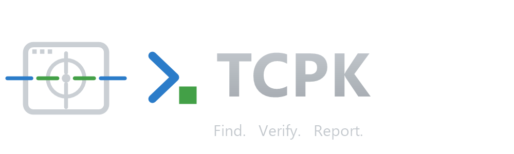
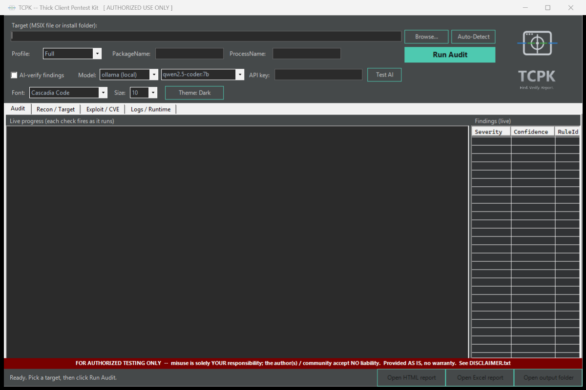
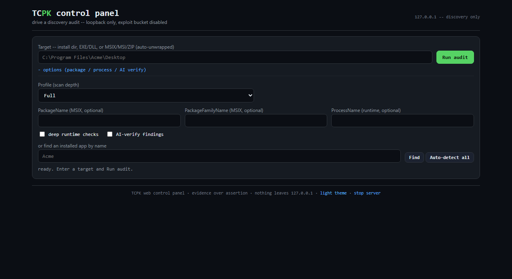

<div align="center">
  

  # TCPK -- Thick Client Pentest Kit

  Portable Windows thick-client / MSIX security audit tool.
  **Find. Verify. Report.**

  PowerShell engine, WPF/WinForms GUI, a loopback web control panel, and a native MCP server. 174 cmdlets.
  Authorized testing only.
</div>

---

## The tool



Point it at an MSIX package, an installed folder, or a single `.exe`, click **Run Audit**,
and TCPK runs ~168 checks across 10+ buckets, streams findings live, and writes
HTML + Excel reports. Every finding carries a confidence label, a **computed CVSS v4.0
base score**, CWE, MITRE ATT&CK, and an OWASP TASVS / Desktop-App-Top-10 mapping.

The same audit also drives a **loopback web control panel** (new in v1.5.0) --
discovery-only, token-gated, bound to `127.0.0.1`:



## What makes it different

- **Evidence over guessing.** Substring/regex hits are labelled `Inferred`. A Mono.Cecil
  IL bridge then *proves* the high-value ones -- e.g. an accept-all TLS certificate
  callback is decompiled and proven to return `true` unconditionally, promoting it to
  `Confirmed` with the exact assembly / type / method / metadata token / call site.
- **Real-bug-vs-FP IL verification.** Beyond TLS, the IL pass confirms dangerous call
  sites (command exec, SQL/LDAP/SSRF, deserialization -- managed *and* P/Invoke) with a
  bounded source-to-sink taint check: if external input (file / registry / network / IPC /
  HTTP request) or a caller parameter reaches the sink it is promoted to `Confirmed (IL)`;
  a constant-only or never-invoked match is demoted to `Likely-FP (IL)`. No model, fully
  deterministic, runs before the optional LLM pass.
- **Real CVSS v4.0 scores.** A faithful port of the FIRST.org reference algorithm +
  macrovector lookup computes the base score from each finding's vector -- a *local*
  issue is scored `AV:L`, not mislabelled like a network one. No fabricated numbers.
- **Supply-chain CVE matching.** Shipped components are matched against an offline, curated
  CVE catalog by exact `deps.json` version (native libraries by name). An optional
  `-OnlineCve` switch additionally queries the OSV API -- off by default, sends only the
  package name + version, fails closed with no network. Either way the matches are embedded
  in a **CycloneDX** `sbom.cdx.json` for hand-off to Grype / OSV-Scanner / Dependency-Track.
- **Optional local-first AI triage.** `-EnableLlm` (or the GUI "AI-verify findings" box)
  pipes code-construct findings through a local Ollama model to annotate confidence.
  Cloud providers are gated behind an explicit opt-in (the decompiled IL never leaves
  the machine by default).
- **Run it your way, read it anywhere.** Drive an audit from the WinForms GUI, the CLI, or
  a **loopback-only web control panel** (`TCPK-WebUI.bat` -- binds 127.0.0.1, token-gated,
  discovery-only) with live progress, pause/resume, and result tabs. Every audit also writes
  a self-contained offline **`intel.html`** dashboard (severity + the evidence ladder, a
  classified recon endpoint map, filterable per-finding cards) next to the HTML / Excel /
  SARIF / SBOM outputs -- one file, no server, no CDN.
- **Engagement-ready reports.** HTML + multi-sheet Excel, including a **Checklist** sheet
  that auto-correlates findings to a 55-case thick-client test plan (with an honest
  auto-status; the tester sets the final PASS/FAIL), a **DLL Hardening** matrix
  (ASLR/DEP/CFG/HighEntropyVA/SafeSEH/GS/ForceIntegrity) and a **DLL Signing** matrix.
  The HTML report **segregates by confidence** -- IL/dynamic-proven findings sort first, with
  an evidence-tier summary and a "Confirmed only" filter, so an `Inferred` pattern hit is
  never mistaken for a proven one.
- **Honest about scope.** It automates the *detection* layer. Dynamic confirmation
  (Burp, mimikatz, EICAR, modify-and-relaunch) stays manual -- and the tool says so.

## Coverage buckets

`A` Static binary - `B` MSIX manifest - `C` OS integration - `D` Credentials -
`E` Runtime/live - `F` Network - `G` WebView2 - `H` Logging - `I` Memory -
`J` Anti-debug - `K` Exploit (gated) - plus Recon / Report.

See [`docs/CHECKS.md`](docs/CHECKS.md) for every check, or the full technical
write-up in [`docs/index.html`](docs/index.html) (also published as a free GitHub
Pages site -- Settings > Pages > Deploy from a branch > `/docs`).

## Test-plan coverage (55 cases)

The Excel report has a **Checklist** sheet that auto-correlates findings to this thick-client
test plan. `AUTO` = TCPK flags the core condition; `PARTIAL` = flags part, rest manual; `GAP` =
no detector (manual). **53 of 55 have automated detection** (31 AUTO + 22 PARTIAL); 2 are
manual-only. Every case still needs the tester's final PASS/FAIL. TC01-TC40 = the imported
plan; TC41+ = extended TCPK coverage. (Not the full check catalogue -- see `docs/CHECKS.md`.)

<details><summary><b>Show all 55 cases</b></summary>

| # | Test case | Type | Coverage |
|---|-----------|------|----------|
| TC01 | Secure Storage encryption & key management | Static | PARTIAL |
| TC02 | Authentication bypass & session management | Static+Dynamic | PARTIAL |
| TC03 | Preferences API client-side authorization bypass | Static | PARTIAL |
| TC04 | WebView JavaScript injection & XSS | Static | AUTO |
| TC05 | XAML injection & ObjectDataProvider RCE | Static | AUTO |
| TC06 | NuGet / dependency vulnerability scanning | Static | AUTO |
| TC07 | Code signing & certificate verification | Static | AUTO |
| TC08 | Anti-tampering & integrity checks | Static | PARTIAL |
| TC09 | HttpClient SSL/TLS configuration | Static | AUTO |
| TC10 | Platform-specific code (P/Invoke, COM interop) | Static | AUTO |
| TC11 | Shell navigation / deep-link security | Static | PARTIAL |
| TC12 | Dependency Injection security | Static | GAP |
| TC13 | Custom handlers security | Static | PARTIAL |
| TC14 | Configuration security (appsettings.json) | Static | AUTO |
| TC15 | Assembly version & update-check security | Static | PARTIAL |
| TC16 | Logging & debug information leakage | Static | AUTO |
| TC17 | Resource file security | Static | AUTO |
| TC18 | Exception handling & error messages | Dynamic | GAP |
| TC19 | Clipboard & data-sharing security | Static | AUTO |
| TC20 | Memory dump analysis | Runtime | PARTIAL |
| TC21 | Windows DPAPI master-key extraction | Static+Dynamic | PARTIAL |
| TC22 | Windows Registry sensitive-data storage | Static | AUTO |
| TC23 | Windows Credential Manager stored credentials | Runtime | PARTIAL |
| TC24 | DLL hijacking (search-order exploitation) | Static | AUTO |
| TC25 | UAC bypass / privilege escalation | Static | PARTIAL |
| TC26 | Windows Defender exclusion abuse | Runtime | AUTO |
| TC27 | MSIX package security analysis | Static | AUTO |
| TC28 | Windows Event Log analysis | Runtime | PARTIAL |
| TC29 | Process injection detection | Static+Runtime | AUTO |
| TC30 | Windows Firewall rule security | Runtime | AUTO |
| TC31 | Named pipe security | Runtime | AUTO |
| TC32 | COM object security | Static+Runtime | PARTIAL |
| TC33 | Windows service security | Runtime | AUTO |
| TC34 | Task Scheduler security | Runtime | AUTO |
| TC35 | WMI security assessment | Runtime | AUTO |
| TC36 | Windows update mechanism | Static+Dynamic | PARTIAL |
| TC37 | ETW (event tracing) security | Static | AUTO |
| TC38 | Windows PE analysis (mitigations) | Static | AUTO |
| TC39 | Shared memory security | Static+Runtime | PARTIAL |
| TC40 | Driver / kernel component security | Static+Runtime | PARTIAL |
| TC41 | [Extended] Insecure deserialization (RCE) | Static | AUTO |
| TC42 | [Extended] XML external entity (XXE) injection | Static | AUTO |
| TC43 | [Extended] Dangerous API call sites (cmd / SQL / SSRF / path / impersonation) | Static | PARTIAL |
| TC44 | [Extended] Electron / Chromium insecure configuration | Static | AUTO |
| TC45 | [Extended] WCF binding security (cleartext / unauthenticated) | Static | AUTO |
| TC46 | [Extended] Archive extraction path traversal (zip-slip) | Static | AUTO |
| TC47 | [Extended] Reflection / dynamic code loading | Static | PARTIAL |
| TC48 | [Extended] Bundled Java archive secrets / insecure TLS | Static | AUTO |
| TC49 | [Extended] Backend endpoint / DNS / dev-endpoint disclosure | Static | AUTO |
| TC50 | [Extended] Rogue / installed trust-store certificates | Static+Runtime | AUTO |
| TC51 | [Extended] Leftover dev / build artifacts shipped | Static | AUTO |
| TC52 | [Extended] Process environment-variable secrets | Runtime | PARTIAL |
| TC53 | [Extended] RPC interface surface | Static | PARTIAL |
| TC54 | [Extended] App Paths / shim-cache persistence & hijack | Runtime | PARTIAL |
| TC55 | [Extended] CSV / spreadsheet formula injection on export | Static | PARTIAL |

</details>

## Supported targets

Path-based, not installer-specific: MSIX / AppX / `.msixbundle` / `.zip`, an installed or
extracted folder, or a single portable `.exe`. Works on MSIX, MSI, ClickOnce, Squirrel
and portable apps alike; the MSIX-manifest checks auto-skip when there is no manifest.
For **thin clients** it audits the **client-side binaries** -- the remote server/API is a
separate web/API engagement.

## Quick start

**GUI:** double-click `TCPK.bat` (or run `Start-TCPKGui.ps1` with `-STA`). Keep the whole
folder together -- the launcher must sit beside the `TCPK\` module folder. Accept the
authorized-use prompt, pick a target, click **Run Audit**.

**PowerShell:**
```powershell
Import-Module .\TCPK\TCPK.psd1 -Force
Invoke-TcpkAudit -Target 'C:\Path\To\App' -Acknowledge          # static + OS + network ...
Invoke-TcpkAudit -Target 'C:\Path\To\App' -Acknowledge -EnableLlm   # + local AI triage
```
Reports land in `.\out\<target>_<date>\` : `index.html`, `report.xlsx` (Summary / Findings /
**Checklist** / DLL Hardening / CVEs / Recon / SBOM), plus `findings.json`, `sbom.cdx.json`,
`attack-surface.json`.

## Requirements

Windows 10/11, PowerShell 5.1 or 7+. Admin only for some deep runtime checks. Optional
local AI needs [Ollama](https://ollama.com) + a pulled model (e.g. `qwen2.5-coder:7b`).

## Authorized use only

For security testing of software you own or are explicitly authorized to test. Misuse may
violate computer-misuse law and licence terms. Provided **AS IS**, no warranty. See
`DISCLAIMER.txt`.

---

TCPK v1.6.1 - see [`README.txt`](README.txt) for the full manual and `docs/` for methodology.
