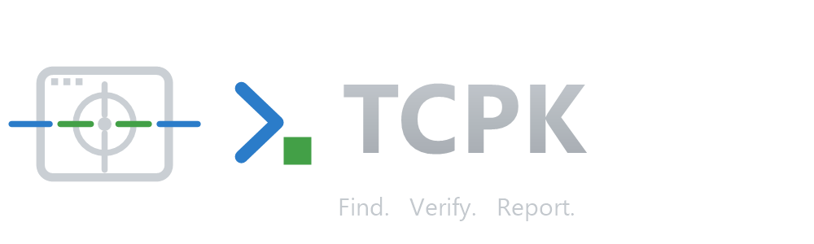
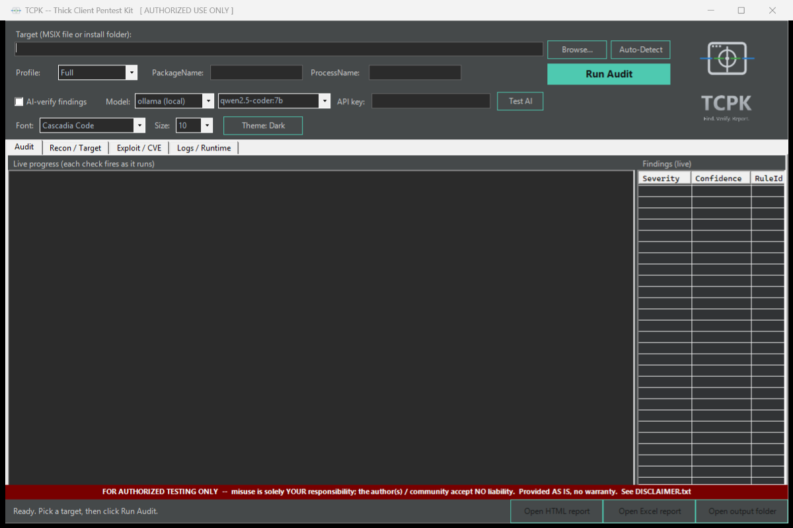
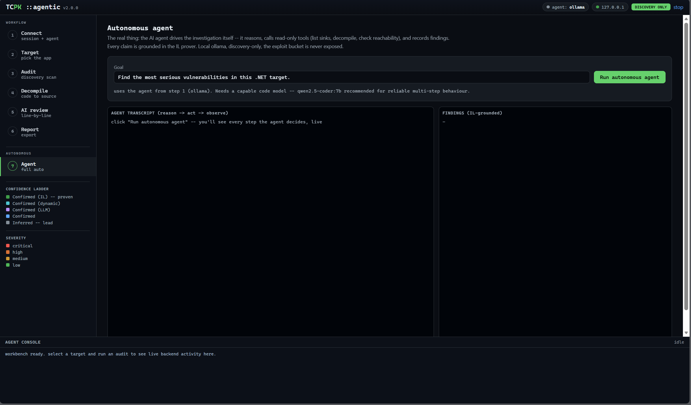

<div align="center">
  

  # TCPK -- Thick Client Pentest Kit

  Portable Windows thick-client / MSIX security audit tool.
  **Find. Verify. Report.**

  PowerShell engine, WinForms GUI, an agentic AI workbench (loopback browser UI), and a native MCP server.
  Authorized testing only.

  [](LICENSE)
  
  

  [Docs](https://v33ru.github.io/tcpk/) - [Real audit report (DVTA)](docs/samples/dvta/report.md) - [Check catalogue](docs/CHECKS.md)
</div>

---

Desktop apps ship secrets in config files, disable TLS certificate validation, and load DLLs
from writable paths. Web scanners never see any of it. TCPK audits the binaries themselves
(MSIX, .NET, Electron, native EXE), proves the real bugs by decompiling the IL, and writes the
client-ready report.

## Quick start

```powershell
git clone https://github.com/V33RU/tcpk.git
cd tcpk
.\TCPK.bat
```

That opens the GUI (keep the whole folder together). Accept the authorized-use prompt, pick a
target, click **Run Audit**. Or drive the same engine from PowerShell:

```powershell
Import-Module .\TCPK\TCPK.psd1 -Force
Invoke-TcpkAudit -Target 'C:\Path\To\App' -Acknowledge              # static + OS + network ...
Invoke-TcpkAudit -Target 'C:\Path\To\App' -Acknowledge -EnableLlm   # + local AI triage
```

Reports land in `.\out\<target>_<date>\`: `index.html`, `report.xlsx`, `findings.json`,
`sbom.cdx.json`, `report.sarif`, `intel.html`.

Want to see the output before installing anything? Read
[the full DVTA audit](docs/samples/dvta/report.md): 35 findings, 1 CRITICAL / 3 HIGH / 8 MEDIUM,
with the evidence grade for every one. Nothing in it is fabricated.

## The tool



Point it at an MSIX package, an installed folder, or a single `.exe`, click **Run Audit**, and
TCPK runs 260 cmdlets across 19 buckets (174 of them detection checks), streams findings live, and writes HTML + Excel
reports. Every finding carries a confidence label, a **computed CVSS v4.0** base score, CWE,
MITRE ATT&CK, and an OWASP TASVS mapping. The same engine drives the CLI, a native **MCP
server**, and an **agentic AI workbench** (`TCPK-Agentic.bat` -- loopback, token-gated,
discovery-only) with decompile, local AI review, and an autonomous agent.



## What makes it different

- **Evidence over guessing.** Regex hits are `Inferred`; a Mono.Cecil IL bridge then *proves*
  the high-value ones (e.g. an accept-all TLS callback decompiled and proven to `return true`)
  and promotes them to `Confirmed (IL)` via a bounded source-to-sink taint check -- deterministic,
  no model.
- **Real CVSS v4.0.** A faithful port of the FIRST.org algorithm scores each finding from its own
  vector, so a local issue is never mislabelled as network-reachable.
- **Supply-chain CVEs.** Shipped components matched against live OSV (NuGet/npm/Maven) + NVD-by-CPE
  (native libs), version-accurate, embedded in a CycloneDX SBOM. Online-only, fails closed.
- **Local-first AI triage (optional).** `-EnableLlm` pipes findings through a local Ollama model;
  cloud is gated behind an explicit opt-in (decompiled IL never leaves the box by default).
- **Engagement-ready reports.** HTML (confidence-segregated) + multi-sheet Excel with a 55-case
  Checklist, DLL Hardening + Signing matrices, plus JSON, SARIF, a CycloneDX SBOM, and a
  self-contained `intel.html` dashboard.
- **Live-process tooling.** A Runtime/Live tab of read-only process checks and a Process Monitor
  (live watch + activity capture), plus a Hex view with a data inspector, strings, and byte
  colouring -- in both the desktop GUI and the agentic workbench.
- **Honest about scope.** It automates *detection*; dynamic confirmation (Burp, mimikatz,
  modify-and-relaunch) stays manual -- and the tool says so.

## Coverage

`A` Static binary - `B` MSIX manifest - `C` OS integration - `D` Credentials - `E` Runtime/live -
`F` Network - `G` WebView2 - `H` Logging - `I` Memory - `J` Anti-debug - `K` Exploit (gated) --
plus Recon / Report.

Full check catalogue in [`docs/CHECKS.md`](docs/CHECKS.md); the 55-case thick-client test plan is
auto-correlated in the Excel **Checklist** sheet (53 of 55 automated). Full technical write-up at
[v33ru.github.io/tcpk](https://v33ru.github.io/tcpk/).

## Supported targets

Path-based: MSIX / AppX / `.msixbundle` / `.zip`, an installed or extracted folder, or a single
portable `.exe` -- MSIX, MSI, ClickOnce, Squirrel, and portable apps alike (manifest checks
auto-skip when absent). For thin clients it audits the client-side binaries; the remote API is a
separate engagement.

## Requirements

Windows 10/11, PowerShell 5.1 or 7+. Admin only for some deep runtime checks. Optional local AI
needs [Ollama](https://ollama.com) + a pulled model (e.g. `qwen2.5-coder:7b`).
Optional tools per tab (Wireshark for pcap, mitmproxy for intercept, frida for runtime
hooks) install separately: see [docs/INSTALL.md](docs/INSTALL.md). The static audit needs none of them.

## Resources

- [Awesome Thick Client Pentesting](https://github.com/V33RU/Awesome-Thick-Client-Pentesting) - curated tooling, writeups and labs for this problem space.

## Acknowledgements

**Srinivas ([DVTA](https://github.com/srini0x00/dvta))** - Damn Vulnerable Thick Client Application.

## Authorized use only

For security testing of software you own or are explicitly authorized to test. Provided **AS IS**,
no warranty. See `DISCLAIMER.txt`. TCPK is MIT licensed; redistributed third-party components and
their licences are listed in `NOTICE`.

---

TCPK v2.9.0 - see [`README.txt`](README.txt) for the full manual and `docs/` for methodology.
