# TCPK Agentic Workbench

The agentic workbench is a browser-based UI for TCPK that runs on a secure
loopback-only HTTP server. It provides a guided pentest workflow, an
autonomous AI agent, and specialised file/process inspection tools -- all
from your browser.

Launch it from PowerShell:

```powershell
Import-Module .\TCPK\TCPK.psd1
Start-TcpkAgentic            # opens your browser automatically
```

**Security model:**
- Binds to 127.0.0.1 only (not reachable from the network).
- Every API request must carry the per-session token (in the URL).
- Host header validated (anti DNS-rebind).
- Discovery only -- the exploit bucket (K01--K06) is never reachable.

---

## Tab overview

The workbench has 13 tabs organised into five sections:
**Overview**, **Scan** (guided), **Agent** (autonomous), **Intercept**,
**Runtime**, and **Files**.

---

### Dashboard (Overview)

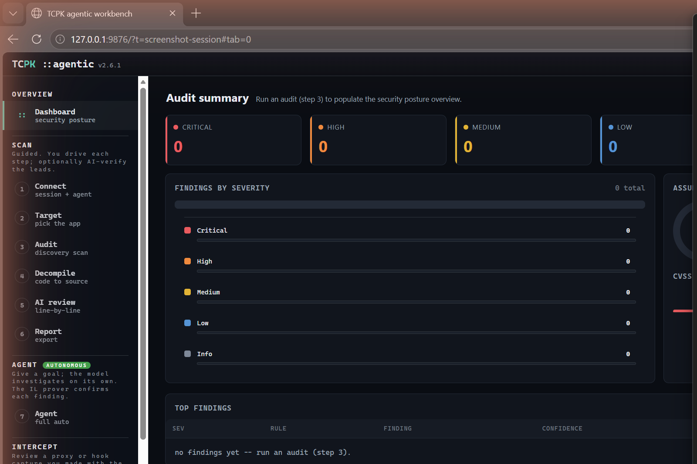

The landing page. After you run an audit (step 3) the dashboard populates
with:

- **Severity KPI cards** -- counts of Critical, High, Medium, Low, Info
  findings plus the maximum CVSS v4.0 score.
- **Findings by severity** -- a horizontal bar chart breaking down finding
  counts.
- **Assurance donut** -- shows how many findings are *Proven*
  (Confirmed IL / dynamic), *Leads* (Inferred, need triage), and
  *Likely-FP* (IL-demoted).
- **CVSS band** -- a colour-coded strip showing the distribution of CVSS
  scores across Critical / High / Medium / Low.
- **Top findings table** -- the most important findings sorted by severity
  and confidence. Act on proven findings first.

**How to use:** Run an audit first (step 3). Return here at any time to see
the overall posture.

---

### 1 -- Connect (session + agent)

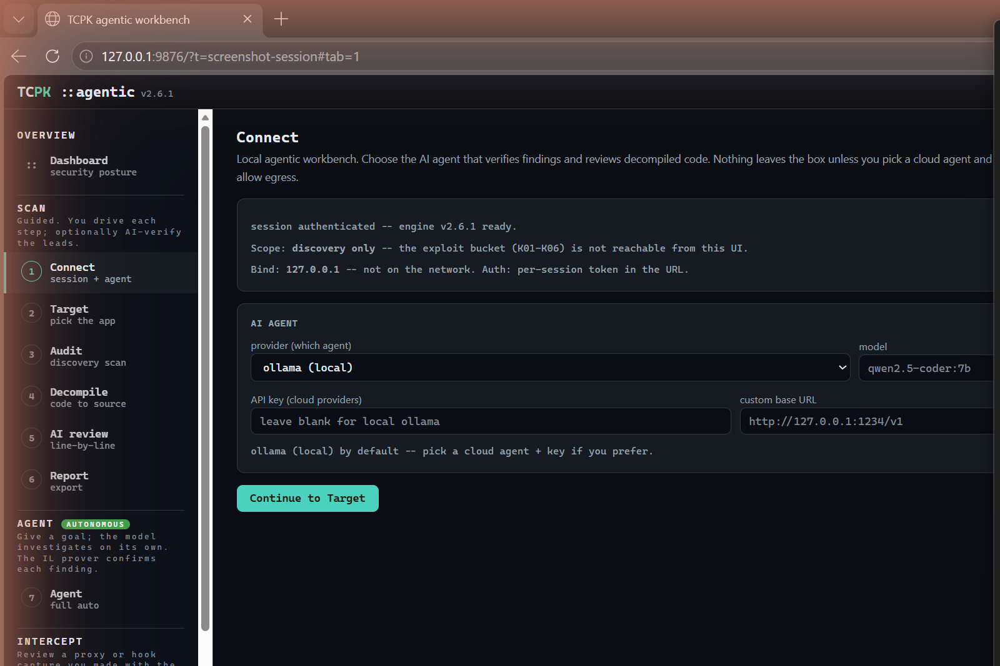

Configure the AI agent that verifies findings and reviews decompiled code.

- **Provider** -- choose between ollama (local, default), Claude, OpenAI,
  Gemini, Grok, DeepSeek, or a custom endpoint.
- **Model** -- the model name (e.g. `qwen2.5-coder:7b` for ollama).
- **API key** -- needed for cloud providers; leave blank for local ollama.
- **Custom base URL** -- for a local server like LM Studio
  (`http://127.0.0.1:1234/v1`).
- **Allow cloud egress** -- uncheck to keep everything on your machine.
- **Test agent** -- verifies the agent connection.

**How to use:** Pick ollama (local) for a zero-egress setup, or a cloud
agent if you prefer. Click "Test agent" to confirm, then "Continue to
Target".

---

### 2 -- Target (pick the app)

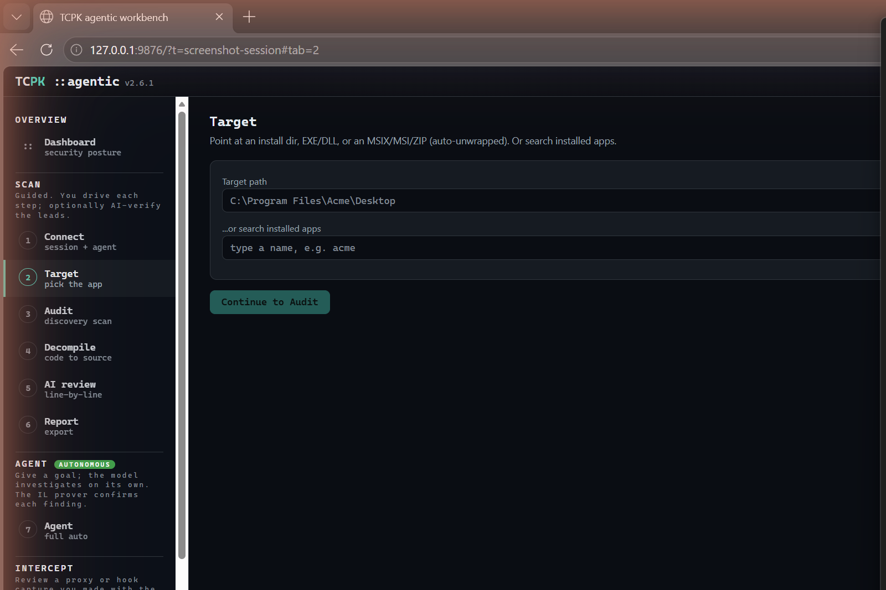

Point TCPK at the application you want to audit.

- **Target path** -- paste a path to an install directory, EXE, DLL, or an
  MSIX/MSI/ZIP file (auto-unwrapped).
- **Search installed apps** -- type a partial name and click Search to find
  installed applications, or click "List all" to see every installed app.
- **Auto-Detect** -- auto-identifies the app framework, runtime, and
  signer.

**How to use:** Paste a path like `C:\Program Files\Acme\Desktop` or search
for an installed app by name. Click "Continue to Audit".

---

### 3 -- Audit (discovery scan)

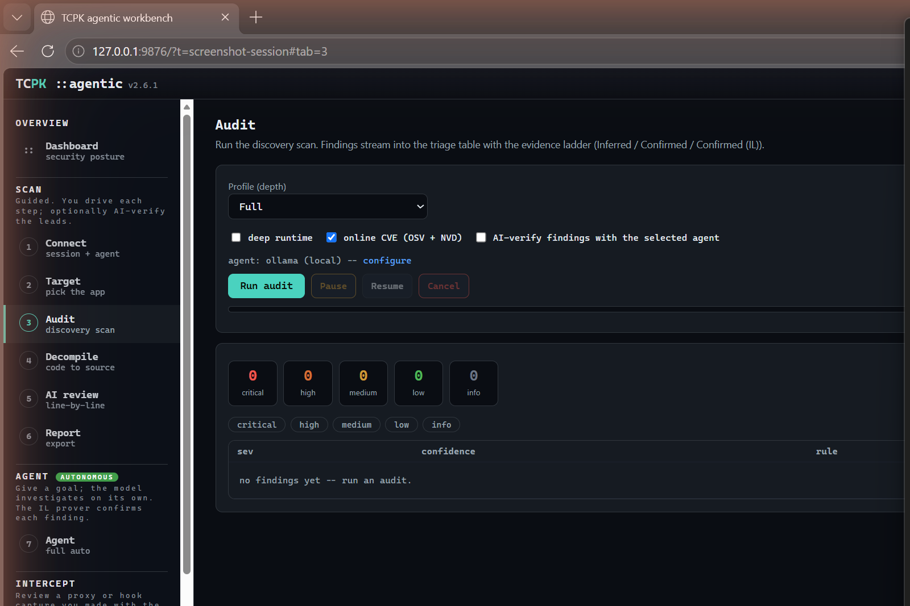

Run the discovery scan. Findings stream in live with the evidence ladder
(Inferred / Confirmed / Confirmed (IL)).

- **Profile** -- Full (all checks), Standard, or Quick (skip slow OS
  scans).
- **Deep runtime** -- enable deep runtime checks (process memory, handles).
- **Online CVE** -- query OSV (NuGet/Electron) and NVD/CPE (native libs)
  for live CVE data.
- **AI-verify findings** -- the selected agent reviews each Inferred
  finding.
- **Run audit / Pause / Resume / Cancel** -- control the scan.
- **Severity counters** -- live KPI tiles and severity filter chips.
- **Findings table** -- sortable by severity, confidence, rule, and title.

**How to use:** Set profile and options, click "Run audit". Findings stream
into the triage table. Filter by severity chip. Click a finding to expand
its evidence.

---

### 4 -- Decompile (code to source)

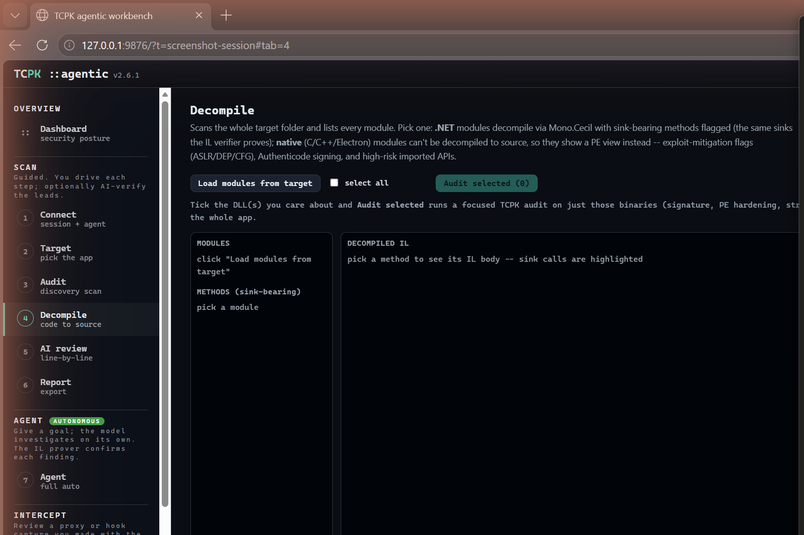

Disassemble .NET modules to IL with Mono.Cecil. Sink-bearing methods are
flagged; native modules show PE metadata instead.

- **Load modules from target** -- enumerates all DLLs and EXEs in the
  target folder.
- **Modules panel** -- pick a module to see its types and methods.
- **Methods (sink-bearing)** -- methods that call known dangerous sinks are
  listed here.
- **Decompiled IL** -- the raw IL body with sink calls highlighted in red.
- **Sinks in method** -- a summary of which sinks the method calls.
- **select all / Audit selected** -- tick modules and run a focused TCPK
  audit on just those binaries.
- **Send to AI review** -- sends the selected method to the AI review tab.

**How to use:** Click "Load modules from target", pick a module, pick a
sink-bearing method, review the IL. Use "Audit selected" for a focused
scan, or "Send to AI review" for an AI opinion.

---

### 5 -- AI review (line-by-line)

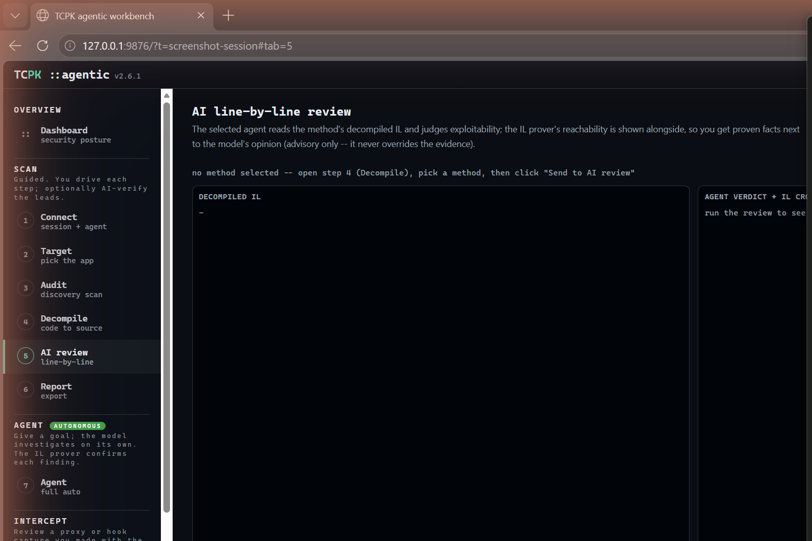

The selected agent reads the method's decompiled IL and judges
exploitability. The IL prover's reachability verdict is shown alongside, so
you get deterministic facts next to the model's opinion (advisory only --
the prover never overrides).

- **Decompiled IL** -- the method's IL body.
- **Agent verdict + IL cross-check** -- the AI's assessment with the
  prover's ground truth.
- **Run AI review** -- starts the agent review.

**How to use:** In the Decompile tab (step 4), pick a method and click
"Send to AI review". Then come here and click "Run AI review". The agent
reads the IL, the prover cross-checks, and you get a grounded assessment.

---

### 6 -- Report (export)

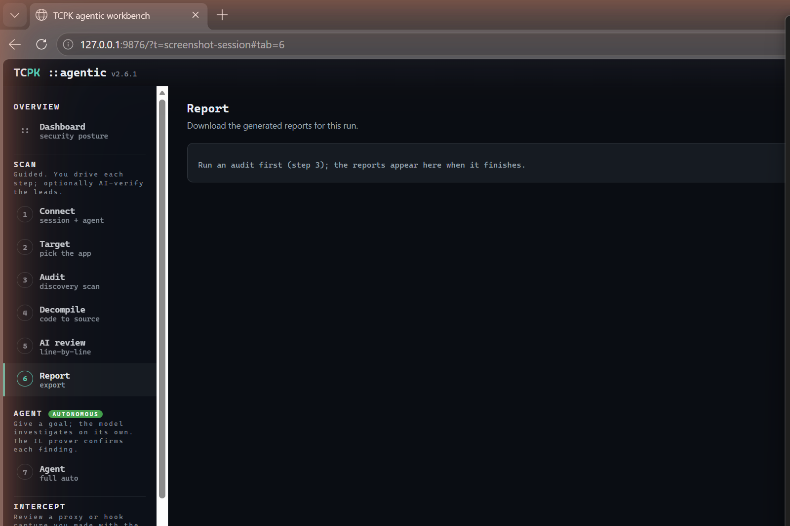

Download the generated reports after an audit completes.

Available report formats:
- **Markdown** -- human-readable summary with findings, evidence, and
  remediation.
- **SARIF** -- machine-readable format for IDE integration.
- **Intel HTML** -- self-contained HTML report with interactive filtering.
- **Checklist XLSX** -- maps findings to the OWASP TASVS checklist.
- **findings.json** -- raw JSON for scripting and CI pipelines.

**How to use:** Run an audit first (step 3). The download links appear here
when it finishes.

---

### 7 -- Agent (autonomous / full auto)

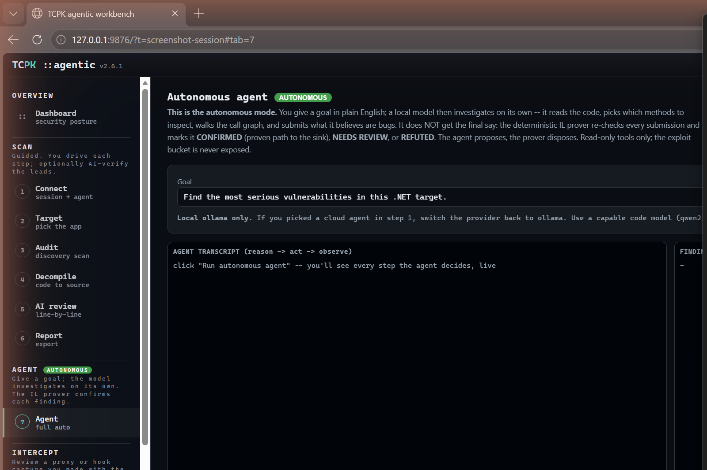

The autonomous mode. You give a goal in plain English; a local model then
investigates on its own -- it reads the code, picks which methods to
inspect, walks the call graph, and submits what it believes are bugs. The
deterministic IL prover re-checks every submission and marks it:
**CONFIRMED** (proven path to the sink), **NEEDS REVIEW**, or **REFUTED**.

- **Goal** -- describe what you want the agent to find (e.g. "Find the most
  serious vulnerabilities in this .NET target").
- **Agent transcript** -- a live feed of the agent's reason/act/observe
  loop.
- **Findings (IL-grounded)** -- the agent's submitted findings with prover
  verdicts.

**How to use:** Set a target (step 2), type a goal, click "Run autonomous
agent". Watch the transcript as the agent investigates. Findings are
verdict-tagged by the IL prover. Local ollama only.

---

### 8 -- Intercept (review capture)

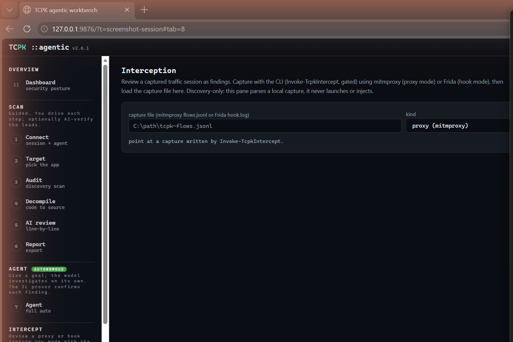

Review a captured traffic session as findings. Capture with the CLI
(`Invoke-TcpkIntercept`, gated) using mitmproxy (proxy mode) or Frida
(hook mode), then load the capture file here.

- **Capture file** -- path to a mitmproxy `flows.jsonl` or Frida
  `hook.log`.
- **Kind** -- proxy (mitmproxy) or hook (Frida).
- **Load capture** -- parses the file and produces findings (credentials,
  tokens, cleartext transport, endpoints).

**How to use:** After running `Invoke-TcpkIntercept` from the CLI, point
this tab at the output file and click "Load capture". Findings from the
wire appear in the triage table.

---

### 9 -- Runtime / Live (live process)

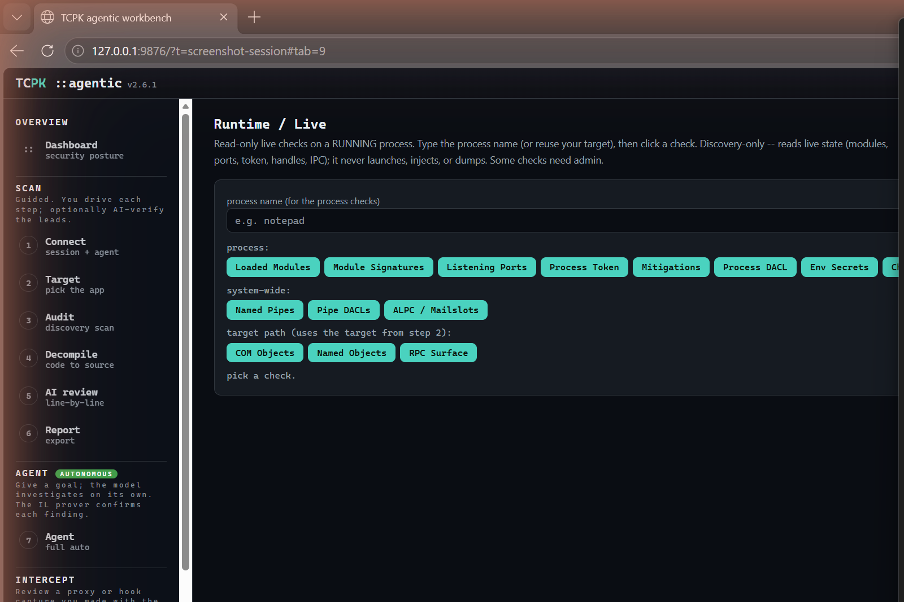

Read-only live checks on a running process. Type the process name (or reuse
your target), then click a check button.

**Process checks:**
- Loaded Modules, Module Signatures, Listening Ports, Process Token,
  Mitigations, Process DACL, Env Secrets, Child Procs, Handles, Windows,
  GUI Inspector

**System-wide checks:**
- Named Pipes, Pipe DACLs, ALPC / Mailslots

**Target path checks:**
- COM Objects, Named Objects, RPC Surface

**How to use:** Type a process name (e.g. `notepad`), click any check
button. Results stream into the output pane. Colour-coded by category:
grey = process, amber = trace (ETW, needs admin), blue = system,
green = target-path, teal = clipboard, red = gated.

---

### 12 -- Process (live watch)

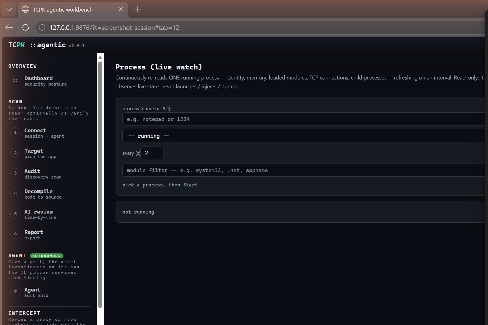

Continuously re-reads ONE running process -- identity, memory, loaded
modules, TCP connections, child processes -- refreshing on an interval.
Read-only: it observes live state, never launches, injects, or dumps.

- **Process** -- name or PID to watch.
- **Refresh list** -- dropdown of currently running processes.
- **every (s)** -- refresh interval (default 2 seconds).
- **Module filter** -- filter loaded modules by substring.
- **Start / Stop** -- begin or end the live watch.

**How to use:** Pick a process by name or PID, set the interval, click
"Start". The display auto-refreshes with the latest state. Use the module
filter to narrow the module list.

---

### 10 -- Asar (unpack + browse)

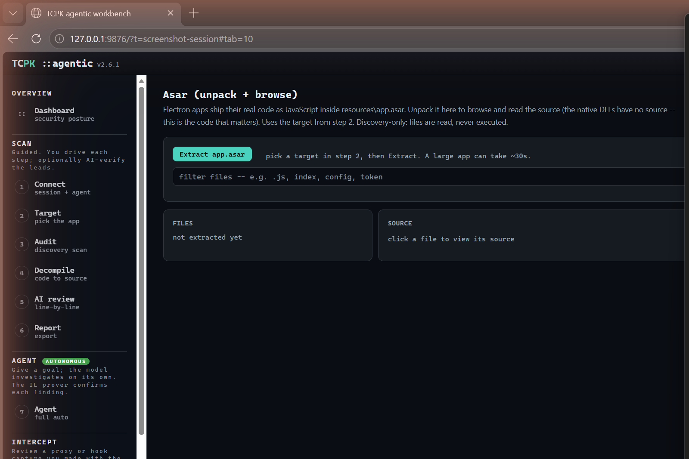

Electron apps ship their real code as JavaScript inside
`resources\app.asar`. Unpack it here to browse and read the source -- this
is the code that matters for security review.

- **Extract app.asar** -- unpacks the archive from the target.
- **Filter files** -- narrow the file list (e.g. `.js`, `index`, `config`,
  `token`).
- **Files panel** -- the extracted file tree.
- **Source panel** -- click a file to view its source code.
- **Analyze folder in Audit** -- run a focused TCPK audit on the extracted
  source.
- **npm audit** -- run a supply-chain audit on bundled node_modules.

**How to use:** Set a target (step 2) that is an Electron app, click
"Extract app.asar". Browse the source, filter by keyword, and review the
JavaScript. Use "npm audit" for supply-chain checks.

---

### 11 -- Hex (byte view)

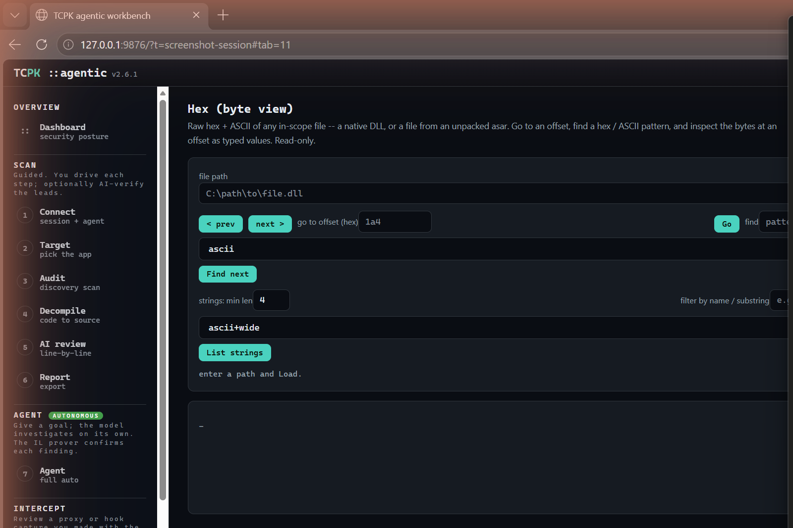

Raw hex + ASCII view of any in-scope file -- a native DLL, or a file from
an unpacked asar.

- **File path** -- enter a path and click "Load".
- **Navigation** -- prev/next page, go to hex offset.
- **Find** -- search for an ASCII or hex pattern.
- **Strings** -- extract strings with a minimum length, filter by
  substring, in ascii, wide (UTF-16), or both.
- **Data Inspector** -- click a hex row to inspect the bytes at that offset
  as typed values (int8/16/32/64, float, double, UTF-8/16).

**How to use:** Enter a file path and click "Load". Browse the hex view,
use "Go" to jump to an offset, "Find next" to search for patterns, or
"List strings" to extract readable strings from the binary.

---

**Search kinds.** The find box takes a kind alongside the query: `auto` (the
default, matching both UTF-8 and UTF-16LE), `ascii`, `utf16le`, `hex`, or
`regex`. Prefer `auto` on a Windows binary -- string literals are stored as
UTF-16LE there, so an ASCII-only search reports nothing for text the file
demonstrably contains. `regex` runs over a latin1 byte view, so a match index
is exactly a byte offset; for the same reason it cannot match UTF-16 text.

**Related endpoints.** Three routes expose the same engines the desktop Hex
tab uses, so the workbench and the GUI cannot drift apart:

| Route | Body | Returns |
|-------|------|---------|
| `POST /api/agent/structure` | `{path, pattern, base}` | A header parsed into named decoded fields. Omit `pattern` to list the shipped patterns, so a dropdown can be filled from the same call. A field that does not fit the file comes back with status `out-of-range` and no value, never one decoded from the following bytes. |
| `POST /api/agent/embedded` | `{path}` | Formats embedded at arbitrary offsets (PE, SQLite, archive, private key), each structurally validated rather than matched on magic bytes alone. |
| `POST /api/agent/filediff` | `{a, b}` | How many bytes two files differ by, where the first difference is, and any length delta. A size mismatch is reported as `lengthDelta` rather than counted as thousands of differing bytes. |

## Quick-start workflow

1. **Connect** -- pick ollama (local) or a cloud agent.
2. **Target** -- point at an install folder or search for an app.
3. **Audit** -- click "Run audit" with Full profile.
4. **Dashboard** -- review the security posture.
5. **Decompile** -- inspect suspicious modules and methods.
6. **AI review** -- get an AI opinion, cross-checked by the IL prover.
7. **Report** -- download Markdown, SARIF, or HTML reports.

For Electron apps, also use the **Asar** tab to unpack and review the
JavaScript source, and the **Hex** tab for binary inspection.

For live testing, use **Runtime** for point checks, **Process** for
continuous monitoring, and **Intercept** to review captured traffic.

For fully autonomous investigation, use the **Agent** tab -- the AI drives
the entire analysis and the IL prover grounds every finding.
