# TCPK Desktop GUI

The desktop GUI is a native WinForms application that runs directly on
Windows -- no browser required. It provides the same discovery scan, plus
exploit PoC generation, credential extraction, traffic interception, live
runtime inspection, and binary analysis tools.

Launch it from PowerShell:

```powershell
Import-Module .\TCPK\TCPK.psd1
Start-TCPKGui
```

**Security model:**
- All exploit and active-testing tools are gated behind an authorization
  checkbox. Nothing active runs until you explicitly opt in.
- Findings are discovery-only by default. The exploit bucket (K01--K06)
  requires the authorization gate.
- The disclaimer banner at the bottom is always visible.

---

## Common controls (top bar)

Every tab shares the same top bar:

- **Target** -- paste or browse to an MSIX file, install folder, EXE, or
  DLL. This is the app you want to audit.
- **Browse / Auto-Detect** -- file picker and automatic framework/runtime
  identification.
- **Profile** -- Full (all checks), Standard, or Quick.
- **PackageName / ProcessName** -- optional filters for MSIX package or
  running process name.
- **Online CVE** -- query OSV and NVD for live CVE data during the scan.
- **AI-verify findings** -- enable AI agent verification (configure
  provider/model/API key on the same row).
- **Font / Size / Theme** -- adjust the GUI appearance.
- **Run Audit / Pause** -- start or pause the discovery scan.

The bottom bar shows report links (HTML, Excel, Markdown) and the
authorization disclaimer.

---

## Tab overview

The GUI has 15 tabs organised into five areas:
**Overview** (Dashboard), **Scan** (Audit, Recon, Exploits, SBOM,
Mitigations, Signing, Logs), **Active testing** (Intercept, Creds),
**Runtime** (Runtime, ProcMon), and **Files** (Asar, Hex, Decompiler).

---

### Dashboard

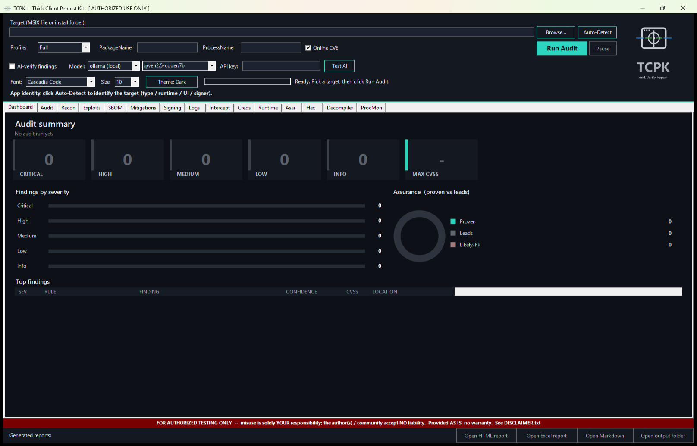

The landing page. After an audit completes, the dashboard populates with:

- **Severity KPI cards** -- counts of Critical, High, Medium, Low, Info
  findings plus the maximum CVSS v4.0 score.
- **Findings by severity** -- horizontal bar chart showing the distribution
  of findings.
- **Assurance donut** -- shows the ratio of Proven (Confirmed IL / dynamic)
  vs Leads (Inferred, need triage) vs Likely-FP (IL-demoted).
- **Top findings table** -- the most important findings sorted by severity
  and confidence, with columns: SEV, RULE, FINDING, CONFIDENCE, CVSS,
  LOCATION.

**How to use:** Set a target in the top bar, click "Run Audit", then return
to Dashboard to see the overall security posture at a glance.

---

### Audit

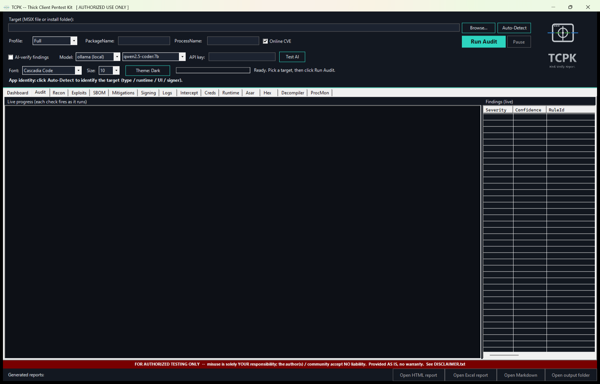

The main scan tab. Findings stream in live as each check runs.

- **Left panel** -- live audit log showing each check as it executes, with
  timing information and severity-coloured output.
- **Right panel** -- findings list with sortable columns.
- **Splitter** -- drag to resize the log vs findings panels.

**How to use:** Click "Run Audit" in the top bar. Watch the log on the left
as checks execute. Findings appear on the right as they are discovered.
Click a finding to see its full evidence and remediation detail.

---

### Recon

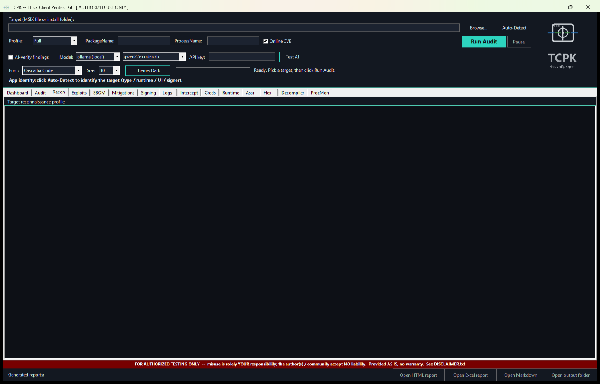

Target reconnaissance profile -- a comprehensive summary of the
application's identity and attack surface.

- **Profile output** -- read-only console showing the full recon report:
  app framework, runtime version, signer, architecture, file counts,
  network endpoints, registry footprint, and more.

**How to use:** Set a target and click "Run Audit" (or "Auto-Detect"). The
recon profile populates automatically. Use it to understand what kind of
application you are testing (Electron, .NET WPF, native C++, MSIX-packaged,
etc.) before diving into findings.

---

### Exploits

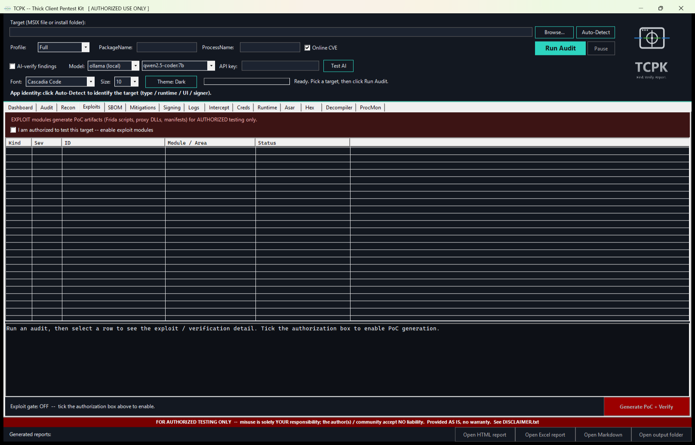

Exploit plan and PoC generation. Every exploit module is gated behind an
authorization checkbox.

- **Authorization banner** -- "EXPLOIT modules generate PoC artifacts
  (Frida scripts, proxy DLLs, manifests) for AUTHORIZED testing only."
- **Authorization checkbox** -- tick "I am authorized to test this target"
  to enable the exploit modules.
- **Exploit list** -- ListView with columns: Kind, Sev, ID, Module/Area,
  Status. Populated after an audit discovers exploitable findings.
- **Detail panel** -- select a row to see the exploit/verification detail
  and the generated PoC code.
- **Generate PoC + Verify** -- button (bottom-right) to generate the PoC
  artifact and run verification. Disabled until the authorization checkbox
  is ticked.

**How to use:** Run an audit first. The exploit list shows which findings
have PoC generators. Tick the authorization checkbox, select an exploit,
and click "Generate PoC + Verify". The PoC script or artifact is written
to the output folder.

---

### SBOM

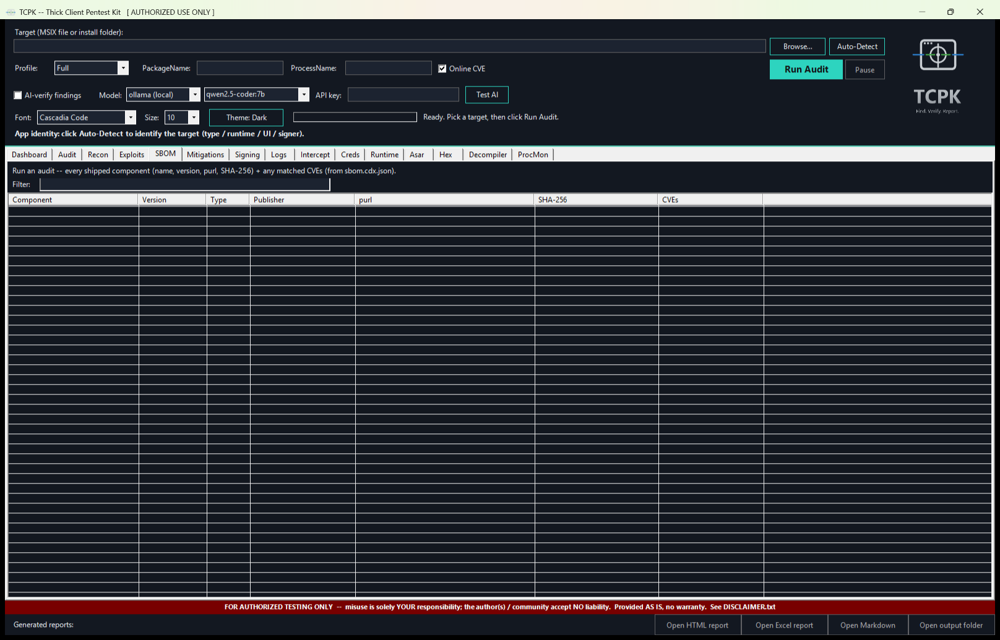

Software Bill of Materials -- every component bundled with the target
application.

- **Filter** -- type to narrow the component list by name, version, or
  type.
- **Component table** -- ListView with columns: Component, Version, Type,
  Publisher, purl, SHA-256, CVEs.

**How to use:** Run an audit. The SBOM table populates with every
identifiable component (DLLs, NuGet packages, Electron modules, native
libraries). Filter by name to find specific dependencies. The CVEs column
shows known vulnerabilities when Online CVE is enabled.

---

### Mitigations

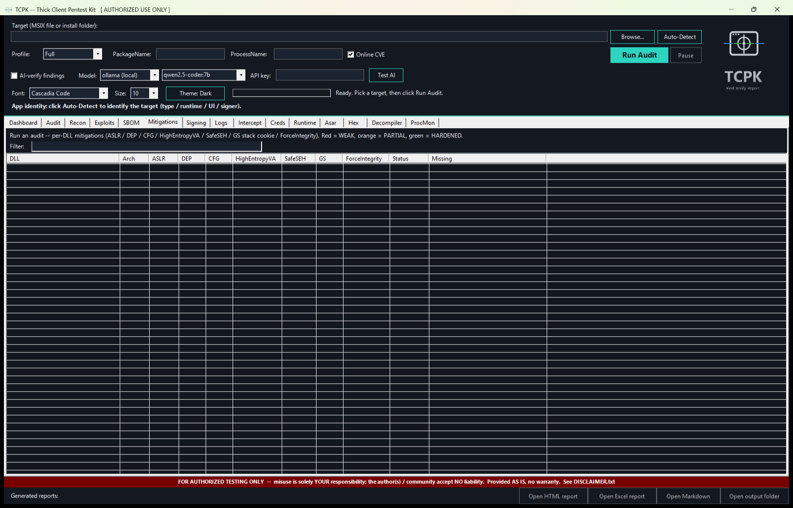

Binary hardening status for every DLL and EXE in the target.

- **Colour key** -- Red = WEAK (missing critical mitigations), Orange =
  PARTIAL, Green = HARDENED.
- **Filter** -- narrow by DLL name or status.
- **Mitigations table** -- ListView with columns: DLL, Arch, ASLR, DEP,
  CFG, HighEntropyVA, SafeSEH, GS (stack cookies), ForceIntegrity,
  Status, Missing.

**How to use:** Run an audit. The table shows the hardening posture of
every binary. Sort by "Status" to find WEAK modules first. The "Missing"
column lists exactly which mitigations are absent. Focus remediation on
binaries that handle untrusted input.

---

### Signing

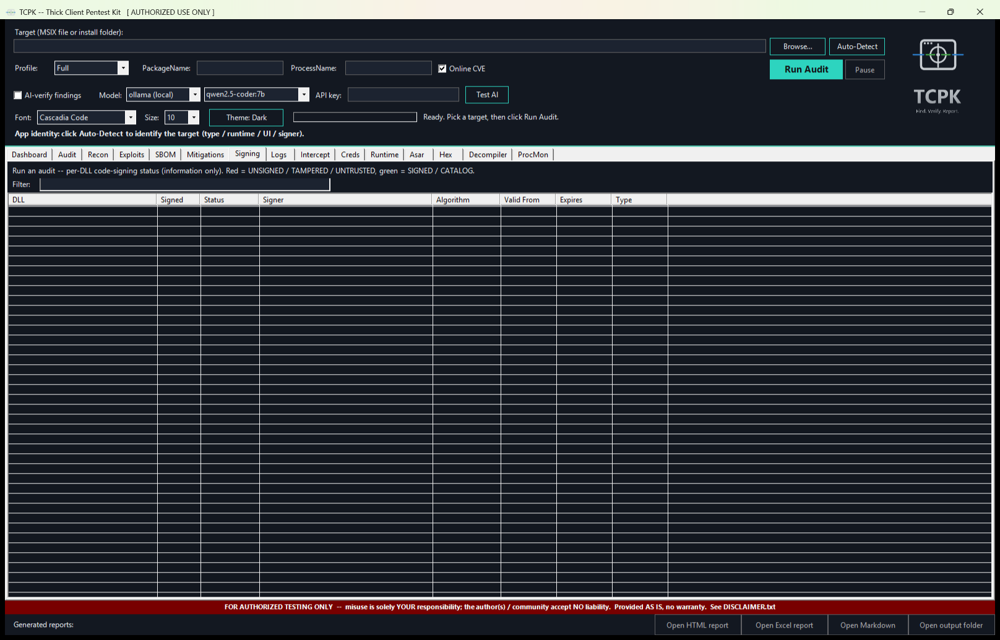

Code signing verification for every binary in the target.

- **Colour key** -- Red = UNSIGNED / TAMPERED / UNTRUSTED, Green = SIGNED
  / CATALOG.
- **Filter** -- narrow by DLL name or signing status.
- **Signing table** -- ListView with columns: DLL, Signed, Status, Signer,
  Algorithm, Valid From, Expires, Type.

**How to use:** Run an audit. The table shows signing status for every
binary. Sort by "Signed" to find unsigned modules. Unsigned or
self-signed DLLs in the application directory are DLL sideloading
candidates. Check "Algorithm" for weak signing (SHA-1).

---

### Logs

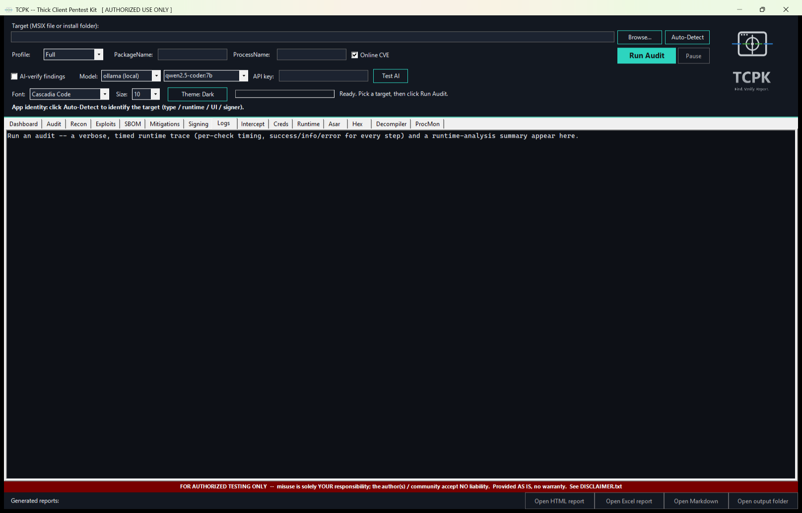

Verbose runtime trace and timing log.

- **Log console** -- read-only Consolas text showing every check that ran,
  how long it took, and any warnings or errors. Severity-coloured output.

**How to use:** Use this tab to review the audit timeline. Each line shows
the check name, duration, and result count. Useful for debugging slow
scans or understanding which checks produced which findings. The log
persists until you run a new audit.

---

### Intercept

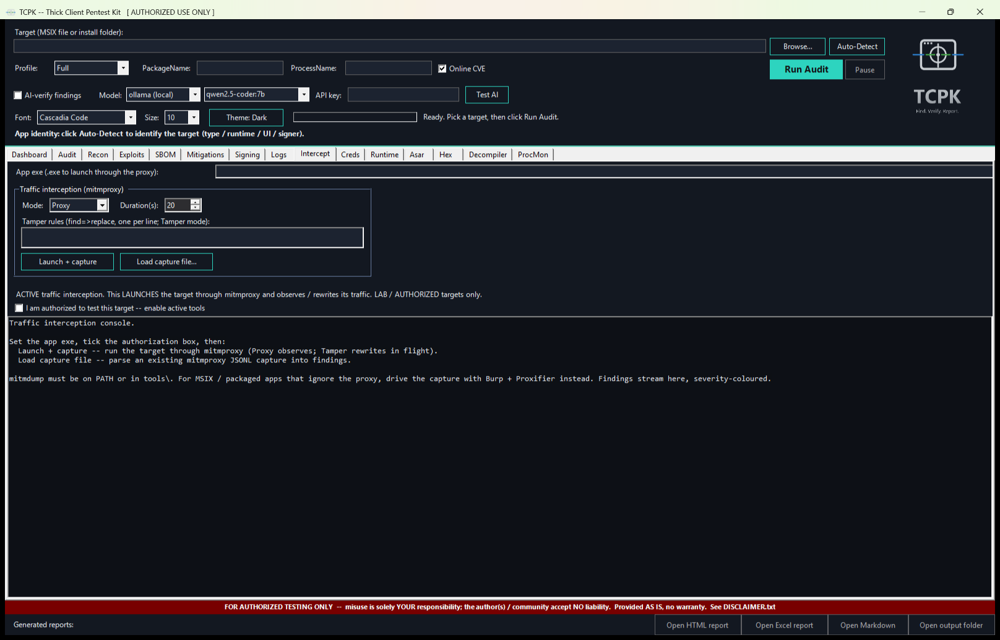

Traffic interception and analysis using mitmproxy (proxy mode) or Frida
(hook mode). Gated behind an authorization checkbox.

- **Authorization banner** -- warns that this performs active traffic
  interception.
- **Authorization checkbox** -- tick to enable interception controls.
- **App exe path** -- path to the application executable to intercept.
- **Traffic interception (mitmproxy)** group:
  - **Mode** -- Proxy (passive capture) or Tamper (modify in-flight).
  - **Duration (s)** -- how long to capture traffic.
  - **Tamper rules** -- multiline text for tamper-mode response
    modification rules.
  - **Launch + capture** -- starts mitmproxy, launches the app through
    the proxy, and captures traffic for the specified duration.
  - **Load capture file** -- load a previously saved capture file for
    analysis.
- **Output console** -- findings from the captured traffic (credentials,
  tokens, cleartext, endpoints).

**How to use:** Enter the app's EXE path, set the mode and duration, tick
the authorization checkbox, and click "Launch + capture". The app launches
through the proxy and traffic is captured. Findings (hardcoded
credentials, cleartext transport, auth tokens) appear in the console.
Alternatively, load a saved capture file for offline analysis.

---

### Creds

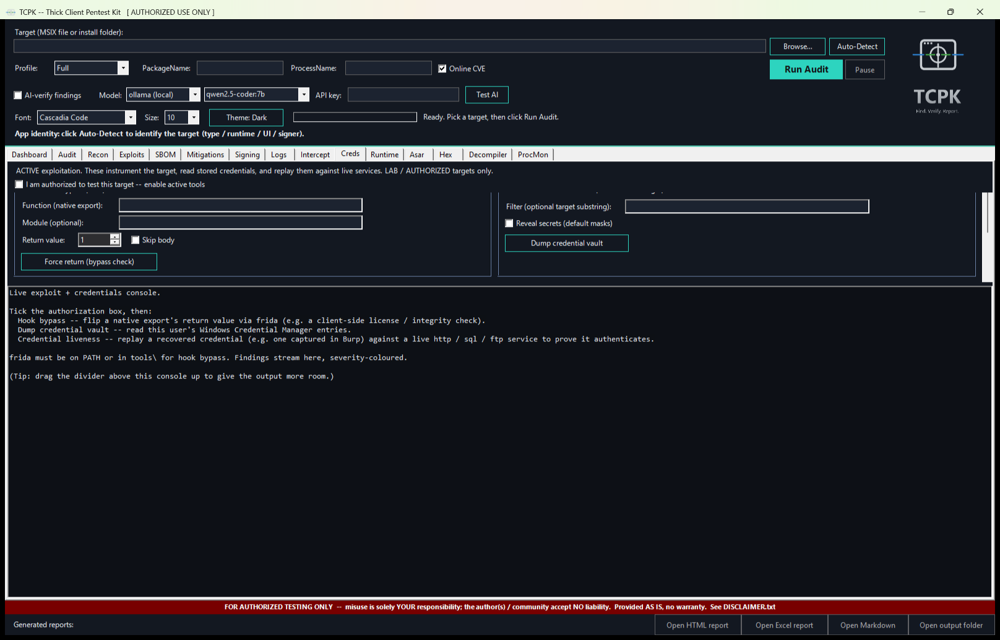

Active credential extraction and replay. Every tool on this tab is gated
behind an authorization checkbox.

- **Authorization banner** -- warns these are active exploitation tools.
- **Authorization checkbox** -- tick to enable all credential tools.
- **Native hook bypass (Frida)** group:
  - **Function / Module** -- the native export to hook.
  - **Return value** -- the value to force-return.
  - **Skip body** -- skip the function body entirely.
  - **Force return (bypass check)** -- hooks the function via Frida and
    forces the specified return value (e.g. bypass a license check).
- **Windows stored credentials (Credential Manager)** group:
  - **Filter** -- narrow by target substring.
  - **Reveal secrets** -- unmask stored passwords.
  - **Dump credential vault** -- reads all entries from Windows
    Credential Manager.
- **Credential liveness** group (not visible without scrolling):
  - **Protocol** -- http, sql, or ftp.
  - **Target / User / Pass / Bearer/DB** -- credential fields.
  - **Test auth (replay)** -- replays the credential against a live
    service to prove it works.
- **Output console** -- results from all credential operations.

**How to use:** Tick the authorization checkbox. Use "Dump credential
vault" to read stored credentials. Use "Force return" to bypass a
client-side check via Frida. Use "Test auth" to prove a recovered
credential is live. All results stream into the output console.

---

### Runtime

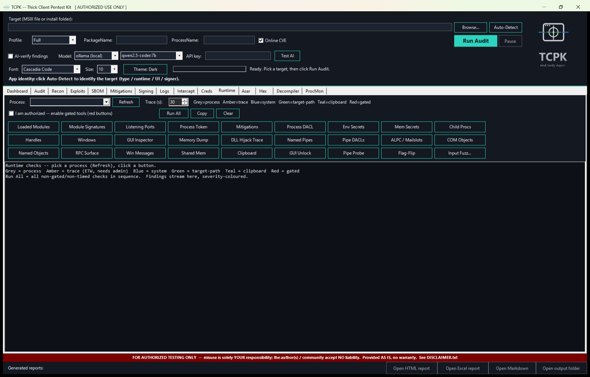

Read-only live checks on a running process. 27 tool buttons organised by
colour-coded category.

- **Process selector** -- pick a running process from the dropdown or
  type a name. Click "Refresh" to update the process list.
- **Trace (s)** -- duration for timed trace tools (default 30).
- **Colour legend** -- Grey = process, Amber = trace (ETW, needs admin),
  Blue = system, Green = target-path, Teal = clipboard, Red = gated.
- **Authorization checkbox** -- enables the red (gated) tools.
- **Run All / Copy / Clear** -- run all non-gated checks in sequence,
  copy output, or clear.
- **Tool buttons** (27 total):
  - **Process** (grey): Loaded Modules, Module Signatures, Listening
    Ports, Process Token, Mitigations, Process DACL, Env Secrets, Mem
    Secrets, Child Procs, Handles, Windows, GUI Inspector, Memory Dump.
  - **Trace** (amber): DLL Hijack Trace.
  - **System** (blue): Named Pipes, Pipe DACLs, ALPC / Mailslots.
  - **Target-path** (green): COM Objects, Named Objects, RPC Surface.
  - **Clipboard** (teal): Clipboard.
  - **Gated** (red): GUI Unlock, Pipe Probe, Flag-Flip, Input Fuzz.
  - **Additional** (grey): Win Messages, Shared Mem.

**How to use:** Type a process name (e.g. `notepad`), click "Refresh",
then click any tool button. Results stream into the output console.
Click "Run All" to run every non-gated check in sequence. Use the gated
tools (red) only after ticking the authorization checkbox.

---

### Asar

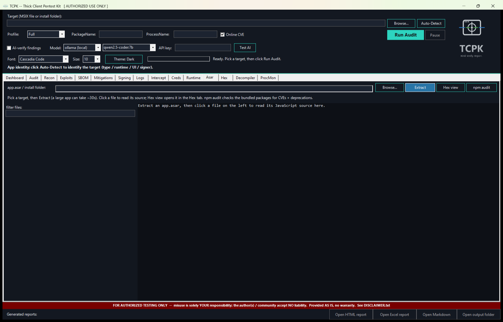

Electron asar archive extraction and source browser.

- **Target path** -- path to the Electron app's install folder or
  app.asar file.
- **Browse / Extract** -- file picker and extraction trigger.
- **Hex view** -- switch to the Hex tab for binary inspection of a
  selected file.
- **npm audit** -- run a supply-chain vulnerability scan on the bundled
  node_modules.
- **Filter** -- narrow the file list by name, extension, or keyword.
- **File list** (left panel) -- all extracted files from the asar archive.
- **Source viewer** (right panel) -- click a file to view its source code
  with syntax highlighting.

**How to use:** Set a target pointing at an Electron app, click "Extract".
The asar archive is unpacked and the file list populates. Use the filter
(e.g. `.js`, `config`, `token`, `password`) to find interesting files.
Click a file to view its source. Click "npm audit" to check for known
vulnerabilities in bundled packages.

---

### Hex

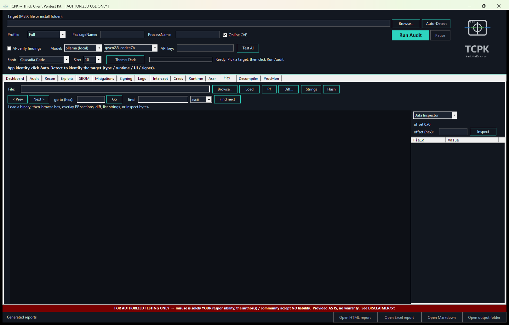

Raw hex + ASCII viewer with PE analysis, string extraction, binary diff,
XOR decode, and data inspection.

- **File path** -- enter a path and click "Load".
- **Toolbar row 1**: Browse, Load, PE (PE structure overlay), Diff
  (binary comparison), Strings (extract readable strings), Hash (file
  hashes).
- **Toolbar row 2**: Prev/Next page navigation, "go to (hex)" offset
  jump, find (ASCII or hex pattern search).
- **Hex view** (main area) -- colour-coded hex display:
  - Dim = null bytes, Blue = whitespace, Green = printable ASCII,
    Orange = control chars, Purple = high/extended bytes.
  - Entropy heatmap strip alongside the hex.
- **Right panel** -- mode-switchable analysis pane:
  - **Data Inspector** -- click a hex row to see typed values at that
    offset: int/uint 8/16/32/64 in both endians, float, double, ASCII,
    unix epoch, plus GUID and FILETIME for Windows structures.
  - **PE Map** -- PE section layout with clickable navigation.
  - **XOR Decode** -- XOR brute-force / single-key decode toolkit.
  - **Byte Freq** -- byte frequency histogram.
  - **Bookmarks** -- save and jump to named offsets.
  - **PE Detail** -- section, export and Rich-header detail tables.
  - **Byte Pattern** -- apply a field table (name / offset / size / type)
    and read the header as decoded rows, with each field tinted in the hex
    view. Ships with sqlite-header, zip-local-header, pe-dos-header and
    wav-header; "Load..." takes your own .json. "At offset" parses a
    structure that is not at the start of the file, for example one located
    by `Test-TcpkEmbeddedBlobs`. A field that does not fit the file shows
    `<out-of-range>` in red rather than a value decoded from the following
    bytes. Same engine as `Get-TcpkFileStructure`.

**How to use:** Enter a file path and click "Load". Browse the hex view
with Prev/Next or jump to an offset with "Go". Click "PE" to overlay PE
section boundaries. Click "Strings" to extract all readable strings.

Search takes a kind alongside the query: `auto` (the default, matching both
UTF-8 and UTF-16LE), `ascii`, `utf16le`, `hex`, or `regex`. Prefer `auto` on
a Windows binary -- string literals are stored as UTF-16LE there, so an
ASCII-only search reports nothing for text the file demonstrably contains.
`regex` runs over a latin1 byte view, so a match index is a byte offset
exactly; for the same reason it cannot match UTF-16 text, where every other
byte is 0x00.
Click "Diff" to compare two binaries side-by-side. Use the right-panel
Data Inspector to decode bytes at the cursor position.

---

### Decompiler

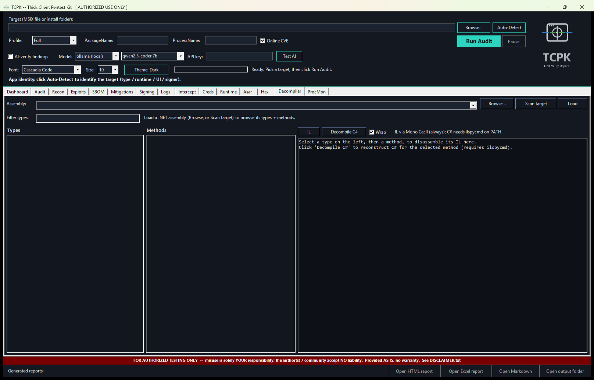

.NET assembly decompiler powered by Mono.Cecil. View IL disassembly or
decompiled C# for any method in any .NET module.

- **Assembly selector** -- ComboBox listing DLLs from the target. Click
  "Scan target" to enumerate all .NET assemblies, or "Browse" for a
  specific DLL.
- **Load** -- load the selected assembly into the decompiler.
- **Filter types** -- narrow the type list by name.
- **Types list** (left column) -- all .NET types in the assembly.
- **Methods list** (centre column) -- methods of the selected type.
- **Code viewer** (right column) -- the decompiled output.
  - **IL** -- raw IL disassembly with sink calls highlighted.
  - **Decompile C#** -- decompiled C# source code.
  - **Wrap** -- toggle word wrap.

**How to use:** Click "Scan target" to find .NET assemblies, pick one from
the dropdown, click "Load". Browse types on the left, methods in the
centre. Click a method to see its IL. Click "Decompile C#" for readable
source. Use "Filter types" to find a specific class. Sink-bearing methods
(calls to dangerous APIs) are highlighted for quick triage.

---

### ProcMon

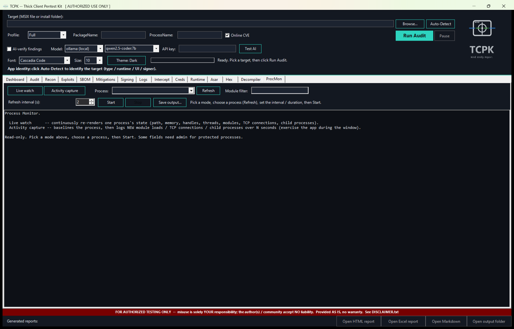

Live process monitor -- continuously observes a running process. Two modes:
live watch (continuous refresh) and activity capture (baseline then detect
changes).

- **Mode buttons** -- "Live watch" or "Activity capture".
- **Process selector** -- pick from running processes or type a name.
  Click "Refresh" to update the list.
- **Module filter** -- filter loaded modules by substring.
- **Interval / Duration** -- refresh interval (live watch) or capture
  duration (activity capture) in seconds.
- **Start / Stop** -- begin or end monitoring.
- **Save output** -- save the current output to a file.
- **Output console** -- displays process identity, memory usage, loaded
  modules, TCP connections, child processes.

**How to use:**

*Live watch mode:* Pick a process, set the refresh interval (default 2s),
click "Start". The display auto-refreshes with the latest state: memory,
modules, connections, children. Use the module filter to narrow the
module list. Click "Stop" when done.

*Activity capture mode:* Pick a process, set the capture duration, click
"Start". TCPK takes a baseline snapshot, then monitors for new module
loads, new TCP connections, and new child processes. Only changes are
reported. Useful for observing what happens when a user performs a
specific action in the app.

---

## Quick-start workflow

1. **Set target** -- paste a path or browse to an install folder.
2. **Auto-Detect** -- click to identify the app framework and runtime.
3. **Run Audit** -- click with Full profile for comprehensive coverage.
4. **Dashboard** -- review the security posture at a glance.
5. **Audit** -- review individual findings with evidence and remediation.
6. **Mitigations** -- check binary hardening (ASLR, DEP, CFG).
7. **Signing** -- verify code signing status.
8. **SBOM** -- review bundled components and known CVEs.
9. **Recon** -- read the full reconnaissance profile.

For Electron apps, also use the **Asar** tab to unpack and review the
JavaScript source, and the **Hex** tab for binary inspection.

For active testing (authorized engagements only):
- **Intercept** -- capture and analyse network traffic.
- **Creds** -- extract stored credentials and test liveness.
- **Exploits** -- generate PoC artifacts for confirmed vulnerabilities.
- **Runtime** -- inspect a live running process (modules, tokens, pipes,
  handles, DACL, secrets).
- **ProcMon** -- continuously monitor a process for state changes.

For .NET deep-dive:
- **Decompiler** -- browse types, methods, IL, and decompiled C#.
